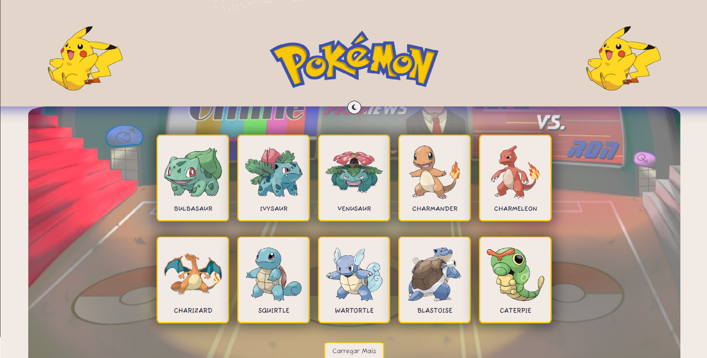
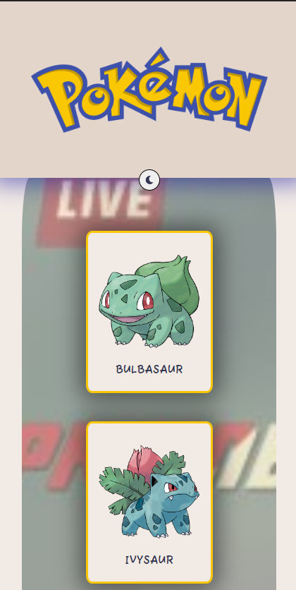

# Pokedex 

Esse projeto consiste no desafio final do curso DevQuest simulando um teste técnico, O projeto foi desenvolvido por mim e os mentores deram o feedback quando finalizado.

## Link de acesso 

<a href="https://questpoke.netlify.app" rel="noreferrer" > 📍Pokedéx </a>

## Tecnologias Utilizadas

- Poke API
- ReactJs
    - Hooks 
    - React Router DOM
- Javascript
- Styled-Components
- CSS
- FetchJS
- ReactIcons

## Requisitos

Criar uma Home (página inicial) de listagem de alguns pokemons,
utilizando a api https://pokeapi.co/

Criar uma página interna de detalhe do pokemon.

A home deve apresentar uma listagem com 10 pokemons
iniciais.
A home deve ter um botão "Carregar mais" abaixo dessa lista,
que quando clicado deve buscar mais 10 pokemons e adicionar
a listagem atual.
Essa listagem deve mostrar a imagem e nome de cada pokemon.
Na listagem cada pokemon deve ser clicável e ao clicar o usuário
deve poder acessar uma página interna desse pokemon com
informaçõões detalhadas, nessa página de detalhes devem
aparecer as seguintes informações:

- Imagem do pokemon
- Nome
- Lista de movimentos do pokemon (moves)
    - a lista de habilidades deve apresentar o nome e o texto
descritivo da habilidade
- Tipo do pokemon (type)
-Essa home deve ter um botão para que o usuário possa
alternar de cor entre tema claro e tema escuro (light/dark)

## Requisitos Técnicos

- A aplicação deverá ser Single Page Application (SPA);
- Utilizar React.js para o desenvolvimento da
aplicação;
- Utilizar Context API para criação do Theme Toggler
(Alternador entre tema claro e escuro);
- Utilizar styled-components para estilização dos
componentes;
- Utilizar react-router-dom para a navegação entre as
páginas;

## Aprendizados e Desafios 

Bom, eu achei que teria muito mais dificuldade de fazer esse projeto sozinho achei que demoraria meses, mas acabei finalizando em 7 dias codando, tive alguns desafios na hora de consumir a api pois tinha muitos endpoints e na hora de apresentar os dados na tela, foi um pouco confuso mas no lendo a documentação e tirando algumas duvidas no final consegui pegar o jeito, por fim acredito que na realização deste projeto eu consegui consolidar muito mais meus conhecimentos em Javasript e React e agora pretendo fazer meu portfólio em React.


## Como rodar o projeto 

Abra o Terminal e execute os seguintes comandos : 

```  
    $ git clone https://github.com/zkauansantos/questPokeAPI.git
 ```

```  
    $ cd questPokeAPI
 ```

```  
    $ npm install
 ```

```  
    $ npm start 
 ```

```  
    $ https://github.com/zkauansantos/questPokeAPI.git
 ```

## Layout do Site


- DESKTOP 

[]()


- MOBILE

[]()


